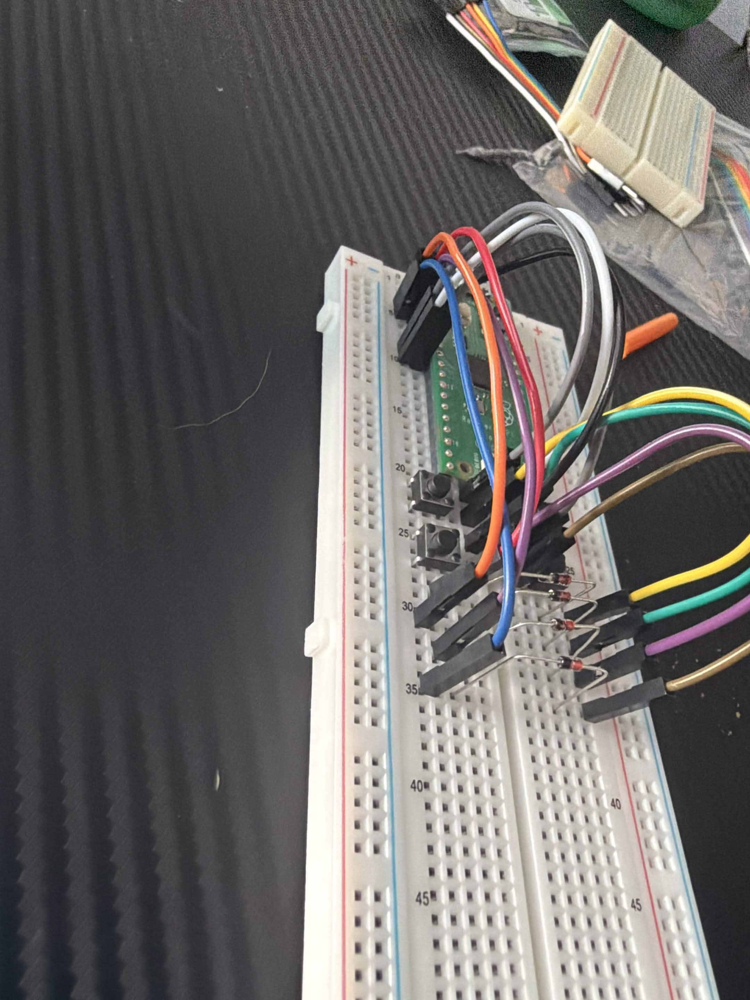

# 16-Key USB Macro Pad

I'm building a 16-key macro pad with a Raspberry Pi Pico H and a custom PCB. I'm using this project to learn PCB design in KiCad and firmware development in C with the Pico SDK.

The PCB is ordered. While I wait for it, I'm testing on a breadboard. So far I've worked through blink, a button-controlled LED, a toggle test, and a basic 2x2 matrix scanner.

## Current progress

- Designed the 4x4 matrix and PCB in KiCad and ordered the boards.
- Tested compiling and flashing firmware onto the Pico H.
- Built a 2x2 breadboard matrix and got switch readings through USB serial.
- Still to do: debouncing, USB keyboard reports, and testing the assembled board.

The current scanner prints button states. It does not act as a USB keyboard yet.

## Files

| File | Purpose |
| --- | --- |
| [blink.c](blink.c) | Raspberry Pi blink example, with the delay changed to 500 ms |
| [buttonLEDtest.c](buttonLEDtest.c) | Onboard LED follows a button on GP6 |
| [togglebuttonLEDtest](togglebuttonLEDtest) | LED toggles on a new button press |
| [2x2buttonmatrix](2x2buttonmatrix) | Scans four buttons and prints their states |
| [processDocumentation.md](processDocumentation.md) | Setup, tests, mistakes, and next steps |

The toggle and matrix files currently have no extension, but contain C code. These are separate experiments with separate main functions; do not build them all into one executable.

## Hardware and wiring

The breadboard test uses a Pico H, USB data cable, breadboard, jumper wires, four momentary pushbuttons, and four 1N4148 diodes. I used a multimeter to identify the button contacts.

The final board uses 16 electrical MX-style switches, 16 diodes, and two 1x20 female headers for the Pico H. My original optical switches were not suitable for this circuit.



Some connections are hidden by wires in the photo, so use the table as well. Disconnect USB before changing the wiring.

| Signal | Pico GPIO | Physical header pin |
| --- | --- | --- |
| ROW0 | GP2 | 4 |
| ROW1 | GP3 | 5 |
| COL0 | GP6 | 9 |
| COL1 | GP7 | 10 |

| Button | Row | Column |
| --- | --- | --- |
| SW1 | ROW0 | COL0 |
| SW2 | ROW0 | COL1 |
| SW3 | ROW1 | COL0 |
| SW4 | ROW1 | COL1 |

Each path is column -> button -> diode -> row. The diode's banded end (cathode, K) connects toward the row. Use button contacts that connect only when pressed.

The columns use internal pull-ups. The scanner drives one row low, reads both columns, and releases that row before selecting the other. A low reading means the button on the selected row is pressed.

## Building a test

My setup uses VS Code, the official Raspberry Pi Pico extension, and Pico SDK 2.3.1. The board target is Pico for the Pico H.

This folder contains source snapshots, not a complete standalone SDK project. CMakeLists.txt and pico_sdk_import.cmake are not included 

1. Create a blink example project using the Pico extension.
2. Replace its blink.c contents with the experiment you want to run.
3. For the matrix test, add these settings after target_link_libraries(blink pico_stdlib) in the generated CMakeLists.txt:

```cmake
pico_enable_stdio_usb(blink 1)
pico_enable_stdio_uart(blink 0)
```

4. Compile the project. The output is still blink.uf2 because the build target is named blink.
5. Hold BOOTSEL while connecting the Pico, then copy the UF2 onto RPI-RP2. The drive disappears when the Pico restarts into the program.

## Viewing the readings

Open a serial monitor, such as Microsoft's Serial Monitor extension in VS Code, and select the Pico's COM port. Windows Device Manager lists it under Ports (COM & LPT). Connect without holding BOOTSEL to run the scanner.

If the monitor asks for a baud rate, use 115200. The connection uses USB serial rather than a physical UART.

```text
SW1=0 SW2=0 SW3=0 SW4=0
```

A 1 means pressed and a 0 means released. There is a 100 ms pause between scans, so short taps can be missed. Hold the buttons while testing. Debouncing is not implemented yet.

## References and learning notes

- [Pico SDK GPIO reference](https://www.raspberrypi.com/documentation/pico-sdk/hardware.html#hardware_gpio)
- [Pico SDK timing reference](https://www.raspberrypi.com/documentation/pico-sdk/high_level.html#pico_time)
- [Pico SDK standard I/O](https://www.raspberrypi.com/documentation/pico-sdk/runtime.html)

The blink program comes from Raspberry Pi's examples; its copyright and license notice are kept in the file. I started the button test from a supplied tutoring example, then worked through the toggle and matrix tests with guidance and code review. When troubleshooting I try to find problem myself, then if no able to come to a solution (even if not the most elegant) will ask codex for guidance. I do not ask for answers but hints/prompts to get me in the right direction
